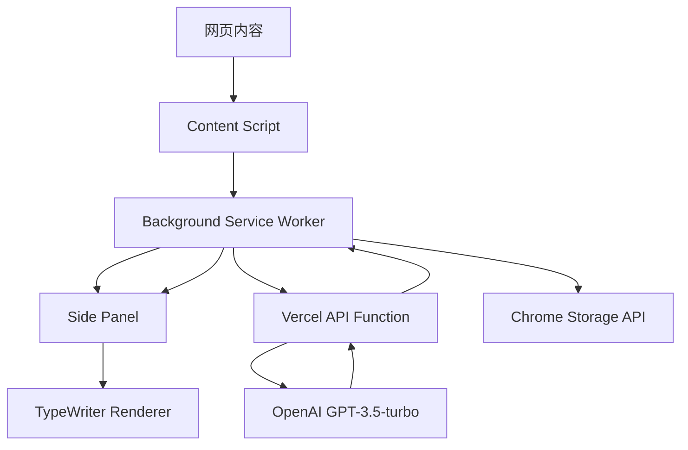
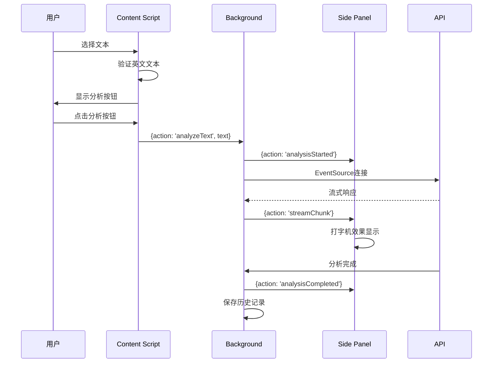
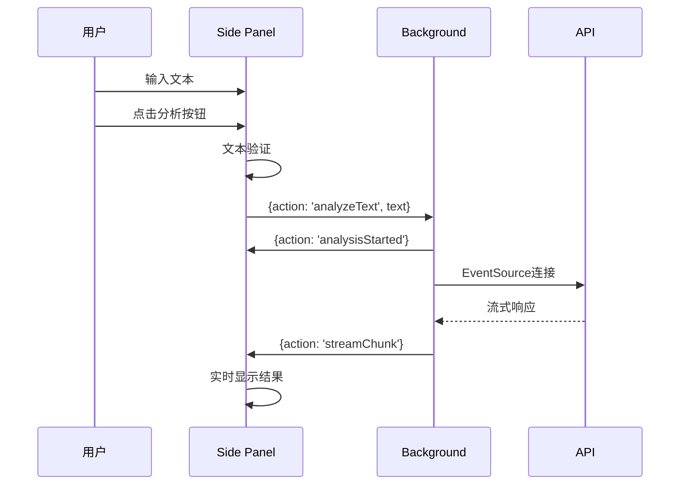

# Chrome 英文语法解析插件 V2.0 详细设计文档

## 🎯 项目概述

### 项目名称
English Grammar Parser - Chrome Extension V2.0

### 项目描述
基于Chrome Manifest V3的智能英语语法分析插件，集成OpenAI GPT-3.5-turbo模型，采用无服务器架构和流式响应技术，为用户提供专业的英语语法分析服务。

### 核心特性
- **智能文本识别**: 自动检测网页英文文本，支持5-500词范围
- **Side Panel界面**: 现代化侧边栏设计，支持多主题
- **流式AI分析**: EventSource实时流式响应，打字机效果展示
- **历史记录管理**: 本地存储最近10条分析记录
- **多种触发方式**: 文本选择、快捷键、手动输入
- **无服务器后端**: Vercel Functions零维护部署

## 🏗️ 系统架构设计

### 整体架构


### 技术栈
- **前端**: Vanilla JavaScript (ES6 Modules), HTML5, CSS3
- **扩展架构**: Chrome Manifest V3, Service Worker
- **后端**: Node.js + Vercel Functions
- **AI服务**: OpenAI GPT-3.5-turbo API
- **流式传输**: Server-Sent Events (EventSource)
- **存储**: Chrome Storage API (Sync)
- **部署**: Vercel 无服务器平台

## 📦 模块设计

### 1. Content Script模块 (`src/content.js`)

#### 功能职责
- 监听网页文本选择事件
- 英文文本智能识别与验证
- 显示浮动分析按钮
- 与Background Script通信

#### 核心实现
```javascript
// 文本选择处理
function handleTextSelection(e) {
  if (selectionTimeout) clearTimeout(selectionTimeout);
  selectionTimeout = setTimeout(() => {
    processTextSelection();
  }, 300);
}

// 英文文本检测
function isEnglishText(text) {
  const englishChars = text.match(/[a-zA-Z\s.,!?;:"'()\-]/g) || [];
  const ratio = englishChars.length / text.length;
  return ratio >= 0.8;
}
```

#### 消息通信协议
```javascript
// 发送给Background
{action: 'analyzeText', text: string}

// 接收自Background
{action: 'analysisStarted', text: string}
{action: 'analysisCompleted'}
{action: 'error', error: string}
```

### 2. Background Service Worker模块 (`src/background.js`)

#### 功能职责
- 作为消息中心，协调各模块通信
- 管理扩展生命周期和事件
- 处理API调用和数据存储
- 实现EventSource流式分析

#### 核心设计模式
采用**中介者模式**，Background Script作为中心协调器：

```javascript
// 消息路由设计
chrome.runtime.onMessage.addListener((request, sender, sendResponse) => {
  switch (request.action) {
    case 'analyzeText': analyzeText(request.text, sender.tab?.id); break;
    case 'getHistory': getHistory().then(sendResponse); return true;
    case 'getSettings': getSettings().then(sendResponse); return true;
    // ... 更多路由
  }
});
```

#### EventSource流式分析实现
```javascript
async function analyzeWithEventSource(text) {
  const settings = await getSettings();
  const apiUrl = settings.apiUrl || 'https://your-app.vercel.app';
  
  return new Promise((resolve, reject) => {
    const eventSource = new EventSource(
      `${apiUrl}/api/analyze?text=${encodeURIComponent(text)}`
    );
    
    eventSource.onmessage = (event) => {
      const data = JSON.parse(event.data);
      if (data.done) {
        eventSource.close();
        resolve();
      } else {
        broadcastMessage({action: 'streamChunk', chunk: data.content});
      }
    };
  });
}
```

### 3. Side Panel模块 (`src/sidepanel.js` + `src/sidepanel.html`)

#### 架构设计
采用**单例模式**和**观察者模式**：

```javascript
class GrammarParserApp {
  constructor() {
    this.currentText = '';
    this.currentAnalysis = '';
    this.isAnalyzing = false;
    this.typewriter = null;
    
    this.initializeElements();
    this.bindEvents();
    this.loadSettings();
    
    // 监听Background消息
    chrome.runtime.onMessage.addListener((message) => {
      this.handleMessage(message);
    });
  }
}
```

#### UI组件设计
```html
<div class="app-container">
  <header class="app-header">
    <!-- Logo和操作按钮 -->
  </header>
  
  <main class="main-content">
    <section class="selected-text-section">
      <!-- 选中文本显示 -->
    </section>
    <section class="input-section">
      <!-- 手动输入区域 -->
    </section>
    <section class="result-section">
      <!-- 分析结果显示 -->
    </section>
  </main>
  
  <aside class="history-sidebar">
    <!-- 历史记录侧边栏 -->
  </aside>
  
  <aside class="settings-sidebar">
    <!-- 设置侧边栏 -->
  </aside>
</div>
```

### 4. TypeWriter渲染器 (`src/utils/typewriter.js`)

#### 设计模式
采用**队列模式**和**流水线模式**：

```javascript
export class TypewriterRenderer {
  constructor(container, options = {}) {
    this.queue = [];
    this.isTyping = false;
    this.currentContent = '';
  }
  
  // 队列处理机制
  async processQueue() {
    while (this.queue.length > 0) {
      const content = this.queue.shift();
      await this.typeContent(content);
    }
  }
  
  // Markdown解析管道
  parseMarkdown(content) {
    return content
      .replace(/^### (.*$)/gm, '<h3>$1</h3>')
      .replace(/^## (.*$)/gm, '<h2>$1</h2>')
      .replace(/\*\*(.*?)\*\*/g, '<strong>$1</strong>')
      .replace(/\*(.*?)\*/g, '<em>$1</em>');
  }
}
```

### 5. Vercel API函数 (`api/analyze.js`)

#### 无服务器函数设计
```javascript
export default async function handler(req, res) {
  // CORS处理
  res.setHeader('Access-Control-Allow-Origin', '*');
  
  // 参数验证
  const text = req.method === 'GET' ? req.query.text : req.body.text;
  if (!text) {
    res.status(400).json({ error: '缺少文本参数' });
    return;
  }
  
  // 设置SSE头
  res.writeHead(200, {
    'Content-Type': 'text/plain; charset=utf-8',
    'Cache-Control': 'no-cache',
    'Connection': 'keep-alive'
  });
  
  // 流式分析
  await streamAnalysis(buildGrammarAnalysisPrompt(text), res);
}
```

#### AI Prompt模板设计
```javascript
function buildGrammarAnalysisPrompt(text) {
  return `请你当我的英语老师。我给你一段英文，你帮我分析这段英文的句式和语法。

规则：
- 请按照以下格式逐句分析：
1. 句子：[原句]
2. 语法结构：[解释句子的语法和结构]
3. 高级词汇（B1以上）：[列出B1级别以上的词汇/短语，同义词和例句]
4. 整体理解：[解释句子的含义]
5. 知识要点：
   - 专业术语：[如有，提供准确定义]
   - 文化典故：[如有，说明其历史背景]
   - 历史背景：[如相关，解释其影响]

要分析的英文文本：
${text}`;
}
```

## 🔄 数据流设计

### 消息通信架构
系统采用**发布-订阅模式**和**消息总线架构**：

```javascript
// Background Script作为消息总线
function broadcastMessage(message) {
  // 发送到Side Panel
  chrome.runtime.sendMessage(message).catch(() => {
    // Side Panel可能未打开，忽略错误
  });
  
  // 发送到Content Script
  chrome.tabs.query({active: true, currentWindow: true})
    .then(([tab]) => {
      if (tab) {
        chrome.tabs.sendMessage(tab.id, message).catch(() => {});
      }
    });
}
```

### 用户操作流程

#### 流程1: 文本选择分析


#### 流程2: 手动输入分析


### 数据存储设计

#### Chrome Storage架构
```javascript
// 设置数据结构
const defaultSettings = {
  theme: "light",           // 主题设置
  autoTrigger: true,        // 自动触发
  minWords: 5,              // 最少单词数
  maxWords: 500,            // 最多单词数
  apiUrl: "https://..."     // API地址
};

// 历史记录数据结构
const historyItem = {
  id: string,               // 唯一ID
  text: string,             // 原始文本
  result: string,           // 分析结果
  timestamp: number         // 时间戳
};
```

## 🎨 UI/UX设计

### 设计系统
- **颜色方案**: 蓝色系主色调 (`#667eea`)，支持浅色/深色主题
- **字体系统**: 系统字体栈，中英文混排优化
- **间距系统**: 8px基础网格，4/8/12/16/24/32px标准间距
- **组件设计**: 模块化组件系统，响应式设计

### 响应式设计
```css
/* 适应不同Side Panel宽度 */
.app-container {
  width: 100%;
  min-width: 300px;
  max-width: 400px;
}

/* 移动端适配 */
@media (max-width: 320px) {
  .main-content { padding: 8px; }
  .section-header h3 { font-size: 14px; }
}
```

### 动效设计
- **加载动效**: 进度条 + 旋转加载器
- **打字机效果**: 可配置速度，标点停顿
- **过渡动效**: 0.3s缓动函数
- **微交互**: 按钮hover、focus状态

## ⚡ 性能优化

### 前端优化策略

#### 1. 内存管理
```javascript
// EventSource连接管理
class EventSourceManager {
  constructor() {
    this.activeConnections = new Set();
  }
  
  createConnection(url) {
    const eventSource = new EventSource(url);
    this.activeConnections.add(eventSource);
    
    // 自动清理
    eventSource.addEventListener('close', () => {
      this.activeConnections.delete(eventSource);
    });
    
    return eventSource;
  }
  
  closeAll() {
    this.activeConnections.forEach(es => es.close());
    this.activeConnections.clear();
  }
}
```

#### 2. DOM操作优化
```javascript
// 虚拟滚动（历史记录）
class VirtualScrollManager {
  constructor(container, itemHeight) {
    this.container = container;
    this.itemHeight = itemHeight;
    this.visibleRange = { start: 0, end: 10 };
  }
  
  updateVisibleItems(items) {
    const fragment = document.createDocumentFragment();
    const visibleItems = items.slice(
      this.visibleRange.start, 
      this.visibleRange.end
    );
    
    visibleItems.forEach(item => {
      fragment.appendChild(this.createItemElement(item));
    });
    
    this.container.innerHTML = '';
    this.container.appendChild(fragment);
  }
}
```

### 后端优化策略

#### 1. 流式传输优化
```javascript
// 分块传输策略
async function streamAnalysis(prompt, res) {
  const response = await fetch('https://api.openai.com/v1/chat/completions', {
    method: 'POST',
    headers: {
      'Authorization': `Bearer ${apiKey}`,
      'Content-Type': 'application/json',
    },
    body: JSON.stringify({
      model: 'gpt-3.5-turbo',
      stream: true,              // 开启流式传输
      temperature: 0.3,          // 降低随机性
      max_tokens: 2000,          // 限制token数
      frequency_penalty: 0.1,    // 减少重复
    }),
  });
  
  const reader = response.body.getReader();
  let buffer = '';
  
  while (true) {
    const { done, value } = await reader.read();
    if (done) break;
    
    buffer += decoder.decode(value);
    const lines = buffer.split('\n');
    buffer = lines.pop(); // 保留不完整的行
    
    for (const line of lines) {
      if (line.startsWith('data: ')) {
        processStreamChunk(line.slice(6), res);
      }
    }
  }
}
```

#### 2. 错误处理与重试机制
```javascript
// 指数退避重试
class RetryManager {
  constructor(maxRetries = 3, baseDelay = 1000) {
    this.maxRetries = maxRetries;
    this.baseDelay = baseDelay;
  }
  
  async executeWithRetry(fn) {
    let lastError;
    
    for (let i = 0; i <= this.maxRetries; i++) {
      try {
        return await fn();
      } catch (error) {
        lastError = error;
        
        if (i < this.maxRetries) {
          const delay = this.baseDelay * Math.pow(2, i);
          await this.sleep(delay);
        }
      }
    }
    
    throw lastError;
  }
}
```

## 🔒 安全设计

### 输入验证与过滤
```javascript
// 文本安全验证
function validateAndSanitizeText(text) {
  // 长度验证
  if (typeof text !== 'string' || text.length > 10000) {
    throw new Error('Invalid text input');
  }
  
  // HTML实体编码
  const sanitized = text
    .replace(/&/g, '&amp;')
    .replace(/</g, '&lt;')
    .replace(/>/g, '&gt;')
    .replace(/"/g, '&quot;')
    .replace(/'/g, '&#x27;');
  
  return sanitized;
}
```

### API密钥保护
```javascript
// 环境变量管理
const apiKey = process.env.OPENAI_API_KEY;
if (!apiKey) {
  console.warn('OpenAI API key not configured, using mock response');
  return simulateAnalysis(prompt, res);
}

// 请求频率限制
const rateLimiter = new Map();
function checkRateLimit(clientId) {
  const now = Date.now();
  const requests = rateLimiter.get(clientId) || [];
  
  // 清理1小时前的记录
  const validRequests = requests.filter(time => now - time < 3600000);
  
  if (validRequests.length >= 100) { // 每小时100次限制
    throw new Error('Rate limit exceeded');
  }
  
  validRequests.push(now);
  rateLimiter.set(clientId, validRequests);
}
```

## 🧪 测试策略

### 单元测试
```javascript
// TypeWriter组件测试
describe('TypewriterRenderer', () => {
  let container, typewriter;
  
  beforeEach(() => {
    container = document.createElement('div');
    typewriter = new TypewriterRenderer(container, { speed: 1 });
  });
  
  test('should render markdown correctly', () => {
    const markdown = '**bold** *italic* `code`';
    const expected = '<strong>bold</strong> <em>italic</em> <code>code</code>';
    
    expect(typewriter.parseMarkdown(markdown)).toBe(expected);
  });
  
  test('should handle queue processing', async () => {
    typewriter.addToQueue('Hello ');
    typewriter.addToQueue('World');
    
    await new Promise(resolve => setTimeout(resolve, 100));
    
    expect(typewriter.getCurrentContent()).toBe('Hello World');
  });
});
```

### 集成测试
```javascript
// Chrome Extension API测试
describe('Background Script Integration', () => {
  test('should handle message routing correctly', async () => {
    const mockSender = { tab: { id: 123 } };
    const mockSendResponse = jest.fn();
    
    await chrome.runtime.onMessage.trigger({
      action: 'analyzeText',
      text: 'Test sentence.'
    }, mockSender, mockSendResponse);
    
    expect(analyzeText).toHaveBeenCalledWith('Test sentence.', 123);
  });
});
```

## 📈 监控与日志

### 性能监控
```javascript
// 性能指标收集
class PerformanceMonitor {
  constructor() {
    this.metrics = new Map();
  }
  
  startTimer(name) {
    this.metrics.set(name, performance.now());
  }
  
  endTimer(name) {
    const start = this.metrics.get(name);
    if (start) {
      const duration = performance.now() - start;
      console.log(`${name}: ${duration.toFixed(2)}ms`);
      this.metrics.delete(name);
      return duration;
    }
  }
}

// 使用示例
const monitor = new PerformanceMonitor();
monitor.startTimer('analysis');
await analyzeText(text);
monitor.endTimer('analysis');
```

### 错误跟踪
```javascript
// 统一错误处理
class ErrorTracker {
  static logError(error, context = {}) {
    const errorInfo = {
      message: error.message,
      stack: error.stack,
      context,
      timestamp: new Date().toISOString(),
      userAgent: navigator.userAgent,
      url: window.location.href
    };
    
    console.error('Extension Error:', errorInfo);
    
    // 可选：发送到错误追踪服务
    if (process.env.NODE_ENV === 'production') {
      // sendToErrorService(errorInfo);
    }
  }
}
```

## 🚀 部署与发布

### Vercel部署配置
```json
{
  "version": 2,
  "name": "grammar-parser-api",
  "builds": [
    {
      "src": "api/**/*.js",
      "use": "@vercel/node"
    }
  ],
  "routes": [
    {
      "src": "/api/(.*)",
      "dest": "/api/$1"
    }
  ],
  "env": {
    "OPENAI_API_KEY": "@openai-api-key"
  },
  "functions": {
    "api/**/*.js": {
      "maxDuration": 30
    }
  }
}
```

### Chrome扩展发布流程
1. **代码审查**: ESLint + Prettier代码规范检查
2. **功能测试**: 手动测试 + 自动化测试
3. **打包构建**: 压缩资源，生成.zip文件
4. **商店提交**: Chrome Web Store开发者控制台
5. **版本管理**: 语义化版本控制 (semver)

### CI/CD管道
```yaml
# .github/workflows/deploy.yml
name: Deploy to Vercel
on:
  push:
    branches: [main]

jobs:
  deploy:
    runs-on: ubuntu-latest
    steps:
      - uses: actions/checkout@v2
      - name: Setup Node.js
        uses: actions/setup-node@v2
        with:
          node-version: '18'
      - name: Install dependencies
        run: npm install
      - name: Run tests
        run: npm test
      - name: Deploy to Vercel
        uses: amondnet/vercel-action@v20
        with:
          vercel-token: ${{ secrets.VERCEL_TOKEN }}
          vercel-org-id: ${{ secrets.ORG_ID }}
          vercel-project-id: ${{ secrets.PROJECT_ID }}
```

## 📋 维护与升级

### 版本管理策略
- **主版本号**: 重大架构变更
- **次版本号**: 新功能添加
- **修订版本号**: Bug修复和优化

### 兼容性矩阵
| Chrome版本 | Manifest版本 | 支持状态 |
|------------|-------------|----------|
| 88-113     | V2          | 停止支持 |
| 114+       | V3          | ✅ 完全支持 |

### 监控指标
- **性能指标**: API响应时间、UI渲染时间
- **用户指标**: 活跃用户数、分析次数
- **错误指标**: 错误率、崩溃率
- **业务指标**: 用户满意度、功能使用率

## 🔮 未来规划

### 短期目标 (3个月)
- [ ] 支持更多AI模型选择 (Claude, GPT-4)
- [ ] 添加语音朗读功能
- [ ] 实现批量文本分析
- [ ] 优化移动端体验

### 中期目标 (6个月)
- [ ] 支持自定义分析模板
- [ ] 添加学习进度跟踪
- [ ] 实现多语言支持
- [ ] 集成语音识别功能

### 长期目标 (1年)
- [ ] 开发桌面端应用
- [ ] 构建学习社区功能
- [ ] 引入机器学习个性化推荐
- [ ] 支持企业版功能

---

## 📄 附录

### A. API接口文档
详见 `api/analyze.js` 中的接口实现和注释

### B. 数据结构定义
```typescript
interface SettingsData {
  theme: 'light' | 'dark' | 'auto';
  autoTrigger: boolean;
  minWords: number;
  maxWords: number;
  apiUrl: string;
}

interface HistoryItem {
  id: string;
  text: string;
  result: string;
  timestamp: number;
}

interface AnalysisMessage {
  action: 'analysisStarted' | 'streamChunk' | 'analysisCompleted' | 'error';
  text?: string;
  chunk?: string;
  error?: string;
}
```

### C. 错误代码表
| 错误代码 | 描述 | 解决方案 |
|----------|------|----------|
| E001 | 文本长度不符合要求 | 调整文本长度到5-500词范围 |
| E002 | API连接失败 | 检查网络连接和API配置 |
| E003 | OpenAI API限额超出 | 等待限额重置或升级账户 |
| E004 | 非英文文本 | 选择英文文本进行分析 |

### D. 开发环境配置
```bash
# 环境要求
Node.js >= 18.0.0
Chrome >= 114.0.0

# 开发依赖安装
npm install -g vercel
npm install

# 本地开发服务器
vercel dev

# 代码格式化
npm run format

# 单元测试
npm test
```

---

**文档版本**: V2.0.0  
**更新时间**: 2024-01-XX  
**维护人员**: 开发团队  
**审查状态**: ✅ 已审查 